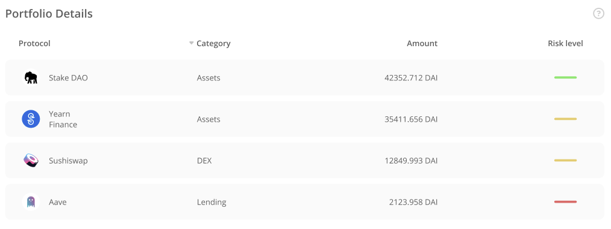
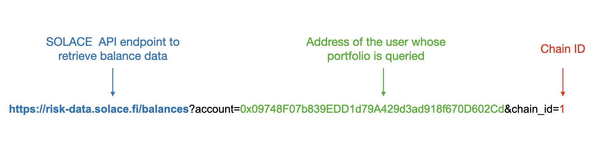

## Introduction

In this documentation we will go through some of options available while integrating Solace Wallet Protection (SWP) into your dApp. 

## Overview on how SWP works
Solace protocol provides a unique service to insure users activity in the DeFi space. To learn more about Solace Wallet Protection check out our blog post or visit solace.fi.

Solace retrieves a list with all user’s positions in different DeFi protocols when they connect their wallet to our app. You will want to do the same thing in your app. Once the portfolio of positions is located they should be covered to USD equivalent. 

Solace has a method for risk assessment of DeFi protocols that takes into account historical exploit data and attributes from each DeFi protocol. We look at attribution like:
 - Age of project
 - TVL
 - Exploits history
 - Use of oracles
 - Transaction history
 - External audits
 - …. 

Solace uses historical data for these parameters as well as expert judgement (determined by governance vote) to calculate the risk rate for each DeFi protocol. 

Based on the information about a user’s positions in DeFi protocols, and the risk scoring of each protocol, Solace calculates the user's portfolio risk rating. The weight of each protocol in the portfolio is determined by the amount locked in that protocol. 

In order to buy an insurance policy for their portfolio a user needs to specify two parameters:

 - Coverage Limit. This is the maximum amount that can be recovered should there be a smart contract exploit that impacts the policy holder.
 - Policy Balance. This is the amount put into a new policy to start coverage. This parameter is used to estimate the length of time the insurance will be in effect. The higher a policy balance is, the longer the insurance term is (assuming a constant risk rate).

When the user purchases a policy an NFT is minted for them with the details of the policy. A policyholder would use this NFT should there be a claim and payout after an exploit.

## Example

A user has 1000$ of crypto assets in Compound, 3000$ of crypto assets in Curve and 6000$ of crypto assets in Maker. All his portfolio has 1000+3000+6000 = 10 000$ value. Let’s assume that the Solace risk assessment algorithm provides us with  0.025 value of risk rate for this portfolio. This mean that Solace will charge 10 000$ * 0,025 = 250$ per year for insurance assuming the current portfolio will not change.  

So if a user wants to purchase a policy for 1 year he needs to pay 250$, for 6 month - 125$, for 1 day - 0.685$ and so on. Here is the main point: the user needs to specify the USD amount he wants to prepaid and then this money will be used as fuel for his insurance. Once prepaid money runs out, user’s policy is no longer active any more and the user will need to reload the policy.
It’s obvious that the portfolio of most users will change over time. Every change in the portfolio will cause recalculation of portfolio risk rate. For example, a user decided to move 3000$ from Curve pool to a highly risky protocol. After this portfolio risk rate will be recalculated and become as high as  9% annually.

From this point Solace will charge 10 000$ * 0.09 = 900$ per year/ 2.465$ per day which is much higher than for the initial portfolio.

## Integration Options

There are several ways to integrate SWP into your dApp:

1 - Use the Solace Risk Data API to get account balances and coverage rates before callingSolace smart-contract infrastructure to purchase a policy. In this case you fully create your own design and components structure to show the user’s portfolio of DeFi positions, quote the annual rate for the SWP policy, and finally sell the policy to the user using your referral code. You will need to call a REST API to quote the rate and call smart contracts to perform the buying/changing a policy.

2 - Call Solace smart-contract infrastructure to purchase a policy. In this case you  call smart contracts to perform the buying/changing a policy. 

Regardless of which integration approach you take, it is important to educate the user as to how their prepaid premium will be applied to their policy as DeFi positions change over time.

## Common UI Components

In your interface you may end up implementing some or all of the following components:
 - A table with rows and columns to hold each DeFi protocol found in the user’s account. We refer to this at the unser’s Portfolio.
 - A component to quote price estimates.
 - A component to support the purchase of a policy or update it’s balance.

### Portfolio details and policy price estimate

The image below shows all user positions in DeFi protocols.
The basic implementation of the table may look like this:



In order to provide rate quotes to the users we need to know what positions they are currently in. We have an API to provide this information. It’s called the /balances method. You can use the SOLACE API endpoint, which will be described below.

The application may retrieve balances for DeFi positions of certain user by making a GET request to the Solace server. Wallet address and chain_id must be provided as query string parameters on a GET call. You should form your GET request in the following way:



NOTE: 
You can get familiar with our API via the [swagger found here]('https://risk-data-docs.solace.fi/')

At the time of this writing  only Ethereum mainnet (chain_id = 1) is supported. More networks will quickly be added throughout 2022. 

Below is the JSON, which is the server's response to the balances GET request :

```js
{ positions:[
{"network": "ethereum",// network name
"appId": "maker",// this a Solace Id that maps to a protocol
"balanceUSD": 16299.596469594648,// USD equivalent of user portfolio
"balanceETH": 6.242573731655248 // ETH equivalent of user portfolio
},
{"network": "ethereum",
"appId": "synthetix",
"balanceUSD": 90.52599153868655,
"balanceETH": 0.034670501068269924
},
{"network": "ethereum",
"appId": "universe",
"balanceUSD": 178.20110353048227,
"balanceETH": 0.06824914530408806,
}
  ]
}
```

The server response makes it clear that the user has locked assets in three protocols and the total portfolio value is $16,568 at the moment of the response. 

## Quoting a Policy Rate
An example implementation of this component may look like this:

In order to calculate policy price estimation you need to get a risk score for the user's portfolio. After you have a portfolio's risk score it becomes possible to calculate the estimation of policy price on the frontend via simple formulas.

In order to get a risk score for a portfolio dApp needs to send a POST request to Solace API endpoint: https://risk-data.solace.fi/scores Try the /scores method yourself.

Unlike /balances, /scores uses a POST request with a body that contain the account and an array of positions. Each position is an object that indicates the network, appId and balance of the position. The simplest way to generate the array of positions for the body is to take the response object after calling /balance. Here’s an example of the body needed to call /scores:

```js
{
 “account”: “0x09748F07b839EDD1d79A429d3ad918f670D602Cd”,
 “positions”: [  {"network": "ethereum",
 "appId": "maker",
 "balanceUSD": 16299.596469594648,
 "balanceETH": 6.242573731655248},

{"network": "ethereum",
"appId": "synthetix",
"balanceUSD": 90.52599153868655,
"balanceETH": 0.034670501068269924},

{"network": "ethereum",
 "appId": "universe",
 "balanceUSD": 178.20110353048227,
 "balanceETH": 0.06824914530408806}
]
}
```

The 200 successful response to a POST /scores request to looks like this:
```js 
{
  "address": "",
  "address_rp": 0.24959999999999996,
  "current_rate": 0.024959999999999996,
  "timestamp": "2022/02/03, 00:38:44",
  "protocols": [
    {
      "network": "",
      "appId": "dodo",
      "balanceUSD": 10,
      "balanceETH": 0,
      "category": "exchange",
      "tier": 2,
      "rol": 0.025,
      "rrol": 0.0192,
      "riskLoad": 0.3,
      "rp-usd": 0.192,
      "risk-adj": 0.0576
    }
  ],
  "metadata": {
    "seriesName": "Series 1",
    "version": "0.0.1",
    "dateCreated": "2021-07-03",
    "provenance": "ipfs://cid0000000",
    "generatedBy": "SolacePublish SDK 0.1 Exporter",
    "sourceDataType": "csv",
    "sourceDataVersion": "0.0.1"
  }
}
```

One of the more important fields here is the current_rate. This field represents the estimated rate the current portfolio would be charged over a one year period. 

You can calculate policy price by the following formulas:
 - USD price per year= USD portfolio equivalent * current_rate
 - USD price per month= USD portfolio equivalent * current_rate/12
 - USD price per day= USD portfolio equivalent * current_rate/365.25

NOTE: it is an estimation assuming that the user will not move his funds between DeFi protocols. As policyholders move in and out of DeFi positions and as position balances rise and fall, Solace will accordingly change risk rate and price of insurance will change over time. Solace protocol keeps track of policyholder positions during the life of a policy.

<div style={{"display":"flex", "justify-content":"center", "align-items":"center", "justify-content":"center" }} >


</div>

NOTE: Displaying portfolio balances and price quotes is not mandatory. You could just sell policies. It’s your decision how to educate the users as to the expected cost.

## Purchase Policy
A component for purchasing a policy will need to ask the user for two parameters:

1 - Coverage limit. Here the user should specify how much of the portfolio they want to insure. This, for example, can be implemented  with a slider.


<div style={{"display":"flex", "margin-bottom":"20px" ,"justify-content":"center", "align-items":"center", "justify-content":"center" }} >


</div>


2 -Set policy balance. Here the user should specify how much premium to prepay for the policy. Based on the user’s portfolio’s risk rate you can calculate on frontend an approximate policy duration. The basic implementation looks like this:


<div style={{"display":"flex", "justify-content":"center", "align-items":"center", "justify-content":"center" }} >


</div>
If the user already has a policy, the Effective balance will be greater than zero as represented on the screenshot above.

NOTE: at the moment policy can only be bought for DAI, other stables will be supported in Q3 2022. 

Your frontend will likely want to collect values for the Policy balance and Coverage limit  fields then invoke activatePolicy method of SolaceCoverProduct smart-contract via any Web3 library you prefer (Web3.js or ethers.js).

Address of SolaceCoverProduct  smart-contract in testnet (Rinkeby):
0x501aCe6B8B28051FEAa14de3F5F878475Cc38F5e

Address of SolaceCoverProduct  smart-contract in testnet (Ethereum mainnet):
Launching Feb 14th, 2022

You can find a draft description of all methods of SolaceCoverProduct here. The most useful functionality for your dApp will be described below:

1- Get status of policy. At the beginning we need to understand if the address has active insurance. There are two options here:
 - If it has, user can add money to policy balance. In order to do so, the deposit method of smart-contract must be invoked.
 - If there is no policy for this address, users need to activate the policy. In this case the activatePolicy method of smart-contract must be invoked.

In order to get policy status you should use the following functions:

 - SolaceCoverProduct.policyOf(address policyholder): you can get the policy ID of the user. If there is no policy, it returns 0.
 - SolaceCoverProduct.policyStatus(uint256 policyID): you can get policy status. False means there is no policy or policy is inactive.
2 - Activate policy. This method will be invoked when the user presses the Activate policy button. Please note that this method is called only if this address has no policy or its policy deactivated. 
```js
SolaceCoverProduct.activatePolicy(
address policyholder, // address of user 
uint256 coverLimit, // Value from Coverage limit field
uint256 amount, // Value from Coverage limit field
)
```

If the connected wallet user wants to buy a policy then policyholder=wallet address.
If the connected wallet user wants to buy a policy for someone else, then policyholder=other user address.

3 - Deposit. This method will be invoked when the user wants to add some DAI to his active policy balance.
```js
SolaceCoverProduct.deposit(
address policyholder,
uint256 amount
)
```
If the connected wallet user wants to deposit, then policyholder=wallet address.
If the connected wallet user wants to deposit for someone else, then policyholder=other user address.

4 - Get policy balance for user. This function to get insurance policy balance for user with specified address.
```js
SolaceCoverProduct.accountBalanceOf(
address policyholder
)
```
5 - Update coverage limit. This method will be called if the user has already purchased a policy, but now wants to update the Coverage limit
```js
SolaceCoverProduct.updateCoverLimit(
uint256 newCoverLimit,
bytes referralCode
) 
```
6 - Get coverage limit.  This method allows to get coverage limit for specified policyID
```js
SolaceCoverProduct.coverLimitOf(
uint256 policyID
)
```
Integration partners will be given a unique referral code. Contact us in the discord to request a referral code for your app. 


