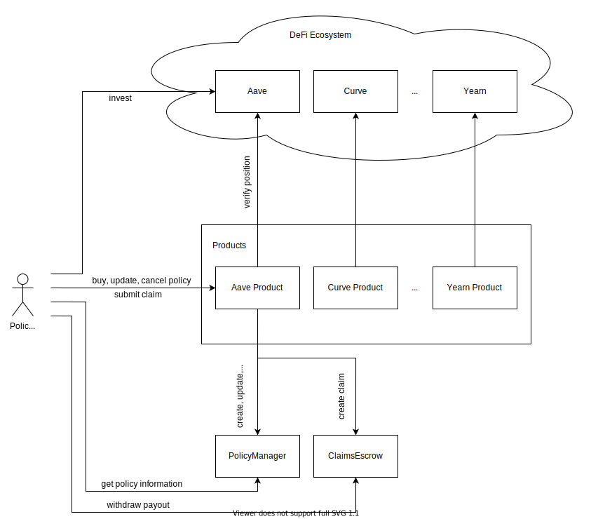

# Policy Holders

On the Solace Protocol, you buy and hold a policy that covers your position in an external protocol and withdraw payout during a loss event.

## Investment

You begin by investing in an external protocol such as Aave, typically via their [frontend](https://app.aave.com).

## Purchasing Policies

You can then buy a policy to cover your position in part or full. You may also determine how long you want the coverage period to last.

## Claims

If you hold a policy for your position during a loss event, that is if an amount of your position is lost for whatever reason. You may submit a claim to get reimbursed the amount that you have lost, as long as it can be covered by your policy.